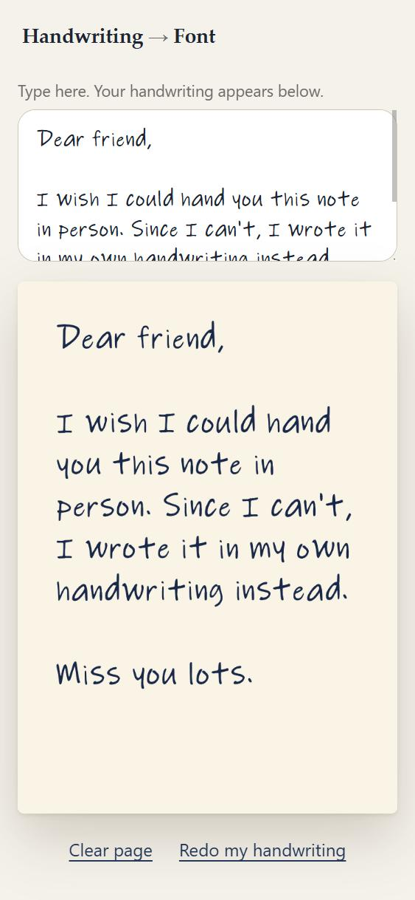
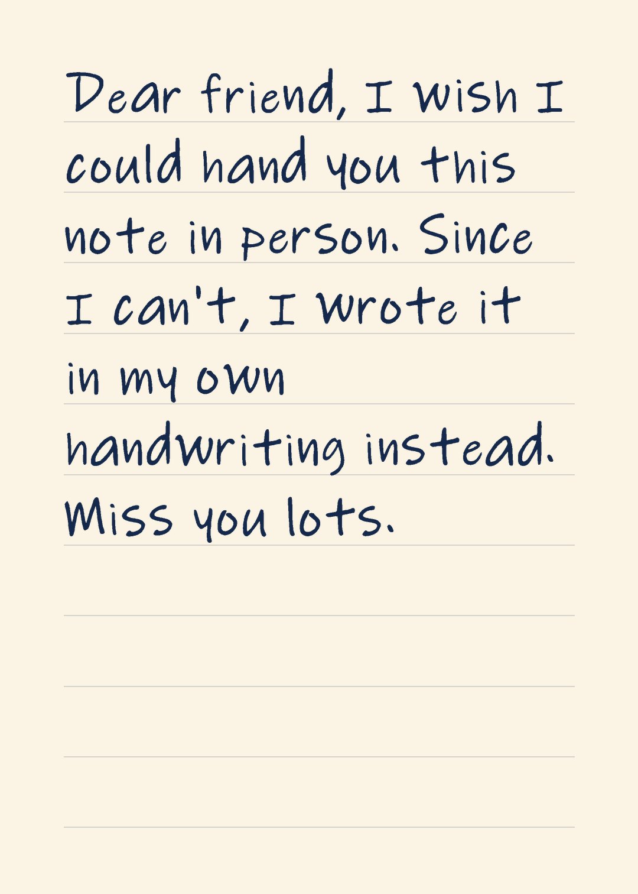

# Handwriting → Font

**Copy a short list onto paper, take one photo, and type anything in your own handwriting. Save it as a PDF or picture for someone you miss, or use it as a real font in Word, Canva and more. Free, no account, and your photo never leaves your device.**

<p align="center">
  
  &nbsp;&nbsp;
  
</p>

<p align="center">
  <a href="https://YOUR-SITE.vercel.app"><b>▶ Open the app</b></a>
  <br><sub>Works on your phone and your computer. Nothing to download. (This link goes live once the site is published.)</sub>
</p>

> *Demo GIF: coming with the reel.* The pictures above use a **placeholder** sample made with a computer handwriting font, until a real handwriting photo replaces it.

---

## Get started (3 steps, about 5 minutes)

There is nothing to install.

1. **Open the app** (the button above).
2. **Write** the list it shows onto plain paper, with a comma after every item.
3. **Take one photo** of the page, and add it. Then start typing.

That's it. Next time you come back, your handwriting is remembered in your browser and you go straight to writing.

> **No paper handy?** Tap *“Try it with a sample sheet”* on the first screen to see the whole thing work first.

## Try it

Open the app, tap the sample sheet link, then *Looks great, start writing*, and type:

```
Dear friend,

I wish I could hand you this note in person. Since I can't,
I wrote it in my own handwriting instead.

Miss you lots.
```

You get this (the card picture and PDF are in [`examples/`](examples/), no install needed to look):

<p align="center"></p>

- [`examples/sample-card.pdf`](examples/sample-card.pdf): the crisp, print-ready version
- [`examples/sample-font.ttf`](examples/sample-font.ttf): the font made from the sample sheet
- [`examples/sample-sheet.jpg`](examples/sample-sheet.jpg): the sample photo the app reads

## What you get

| | |
|---|---|
| **PDF** | Sharp at any zoom and print-ready. Every letter is a vector shape, not a photo of paper. |
| **Picture (PNG)** | Looks good when screenshotted or posted. Your phone's **Share** button sends it straight to a friend. |
| **Font (.ttf)** | A real font file of your handwriting. Install it on a computer to use it in other apps. |

### Where the font works

You type in the app on any device. To use the **font file** elsewhere, install it on a computer first (Windows: right-click the file → *Install*. Mac: double-click → *Install Font*).

| App | Works? |
|---|---|
| Word, PowerPoint (desktop), Pages, Keynote | Yes, once installed. To send a Word file to someone, save it as a **PDF** so they see your handwriting. |
| Photoshop, Premiere, DaVinci Resolve, Final Cut | Yes, once installed. CapCut and Figma desktop: worth a try. |
| Canva | Only **Canva Pro / Teams / Education** (Brand Hub → Fonts → Upload). Free Canva can't add fonts, so use the picture instead. |
| Google Docs and Slides | No. They can't use custom fonts. Send the PDF or picture. |
| Word on the web | Probably not. Check, or use the PDF. |
| Instagram, TikTok text tools | No (built-in fonts only). Post the picture. |
| Your phone | You can write, save and share on a phone. Phones can't install fonts, so use *Send it to myself* to get the font file onto a computer (Drive, email, AirDrop…). |

## How it works

Your photo is straightened, the pencil or pen marks are separated from the paper, and the commas you wrote are used to tell one character from the next. Each character is then traced into a smooth outline (the same kind of shape a real font uses). Those outlines are assembled into a `.ttf` font file, and also used to draw your page and PDF directly. Everything happens inside your browser: there is no server, no AI, no account, and nothing is uploaded.

A tiny natural wobble (a hair of rotation, height and size) is added to the PDF and picture so repeated letters don't look stamped. A font file can't do that, so the installed font draws each letter the same way every time.

## What broke (honest notes)

- **Dense writing looked like table.** The code that finds the paper on a table first treated heavily written areas as "not paper" and erased letters. Fixed by treating anything surrounded by paper as paper.
- **One stray speck scrambled the whole font.** A tiny mark between letters shifted every later letter by one slot (an "M" became a dot) and the app happily built a broken font. It now checks that each box has a believable size for its character and stops with a clear message instead.
- **Real lines of handwriting aren't flat.** Writing on plain paper drifts up or down. Each line's baseline is now fitted as a slope, and ordinary letters sit exactly on it. Letters that hang below the line (g, j, p, q, y) keep their natural place.
- **Tested on synthetic sheets so far.** About fifteen fake photos (tilted, blurry, shadowy, on a table, taken at an angle, with stray marks) were made with computer handwriting fonts. Real handwriting is messier, so expect to tune things as real photos arrive.

## Limits and what's next

- Every letter comes from **one** sample, so double letters (the "ll" in "hello") look identical in the font.
- No accents or emoji yet. Characters that aren't in your list are skipped, and the app tells you.
- Printed or typed text on the page can confuse the reader. Write on a blank sheet.
- Your handwriting is remembered in your browser. Some phones clear that after a while of not visiting, so save the PDF and font you care about.
- Photos should be reasonably straight-on and well lit. It copes with tilt and angles, but a clearer photo gives better letters.

**Version 2 ideas:** write the list twice for letter variety, cursive and joined-up writing, accents and more symbols, a backup file so your handwriting travels between devices, perspective correction for steep angles, and a "watch it write itself" replay.

## Questions, ideas, bugs

Something not working, or a feature you'd love? Open an issue on this repo and say what you tried, in plain words. A photo of the page (if it's okay to share) helps a lot.

## Links

- Reel: *(link coming)*
- Part of **21 Days of Creative Tech**, a body of work about tools for people who make things.

---

### For developers (optional)

The whole app is plain HTML, CSS and JavaScript with no build step and no dependencies. To run it locally, open `index.html`, or serve the folder (`python -m http.server`) and visit `http://localhost:8000`.

Dev-only checks live in `tests/` (they need Node, plus Python with Pillow, NumPy and fontTools; none of this is part of the app):

```bash
python tests/make_sheets.py clean_ink        # make a fake photo of a handwriting sheet
node tests/test_reader.js clean_ink          # read it
node tests/test_tracer.js clean_ink          # trace the letters
node tests/test_font.js clean_ink            # build a .ttf
python tests/validate_font.py clean_ink      # check the .ttf with fontTools
node tests/test_layout.js clean_ink          # page layout
node tests/test_pdf.js clean_ink             # build and check a PDF
```

Run one sheet at a time (they are large images). See [`docs/`](docs/) for the data format and deployment notes.

